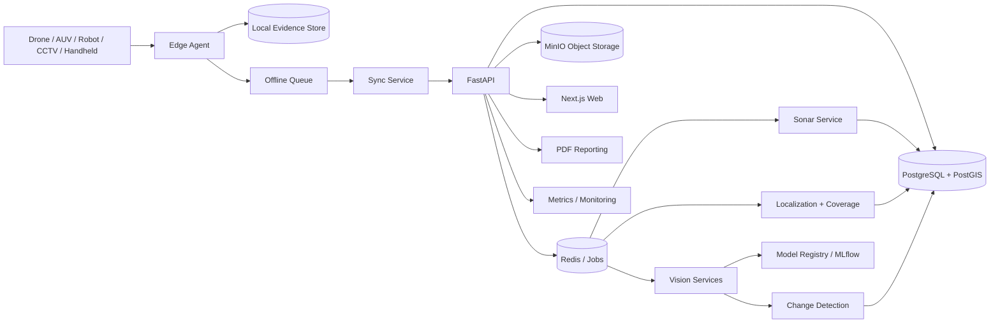
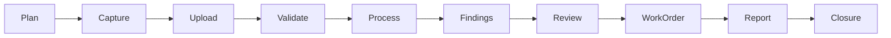
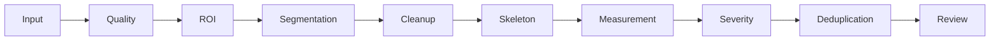
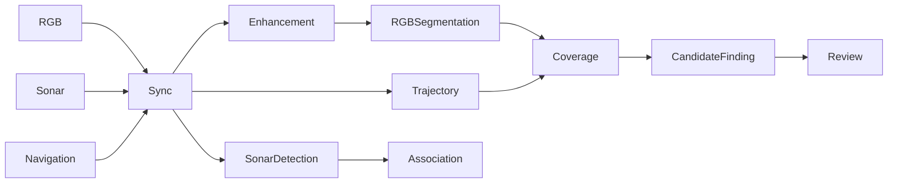
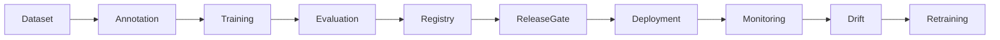
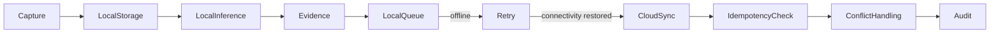
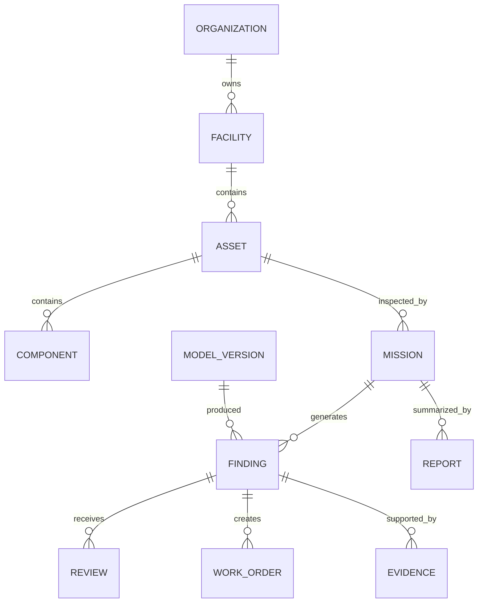

# Architecture

## Complete system

```mermaid
flowchart LR
  D[Drone / AUV / Robot / CCTV / Handheld] --> E[Edge Agent]
  E --> L[(Local Evidence Store)]
  E --> Q[Offline Queue]
  Q --> S[Sync Service]
  S --> API[FastAPI]
  API --> R[(Redis / Jobs)]
  API --> DB[(PostgreSQL + PostGIS)]
  API --> O[(MinIO Object Storage)]
  R --> V[Vision Services]
  R --> SO[Sonar Service]
  R --> LOC[Localization + Coverage]
  V --> CD[Change Detection]
  V --> MR[Model Registry / MLflow]
  SO --> DB
  LOC --> DB
  CD --> DB
  API --> W[Next.js Web]
  API --> P[PDF Reporting]
  API --> M[Metrics / Monitoring]
```

## Inspection mission lifecycle

```mermaid
flowchart LR
  Plan --> Capture --> Upload --> Validate --> Process --> Findings --> Review --> WorkOrder --> Report --> Closure
```

## Structural workflow

```mermaid
flowchart LR
  Input --> Quality --> ROI --> Segmentation --> Cleanup --> Skeleton --> Measurement --> Severity --> Deduplication --> Review
```

## RGB-sonar workflow

```mermaid
flowchart LR
  RGB --> Sync
  Sonar --> Sync
  Navigation --> Sync
  Sync --> Enhancement --> RGBSegmentation
  Sync --> SonarDetection
  Sync --> Trajectory
  RGBSegmentation --> Coverage
  SonarDetection --> Association
  Trajectory --> Coverage
  Coverage --> CandidateFinding --> Review
```

## MLOps lifecycle

```mermaid
flowchart LR
  Dataset --> Annotation --> Training --> Evaluation --> Registry --> ReleaseGate --> Deployment --> Monitoring --> Drift --> Retraining
```

## Offline edge synchronization

```mermaid
flowchart LR
  Capture --> LocalStorage --> LocalInference --> Evidence --> LocalQueue
  LocalQueue -->|offline| Retry
  Retry -->|connectivity restored| CloudSync
  CloudSync --> IdempotencyCheck --> ConflictHandling --> Audit
```

## Domain model

```mermaid
erDiagram
  ORGANIZATION ||--o{ FACILITY : owns
  FACILITY ||--o{ ASSET : contains
  ASSET ||--o{ COMPONENT : contains
  ASSET ||--o{ MISSION : inspected_by
  MISSION ||--o{ FINDING : generates
  FINDING ||--o{ REVIEW : receives
  FINDING ||--o{ WORK_ORDER : creates
  FINDING ||--o{ EVIDENCE : supported_by
  MODEL_VERSION ||--o{ FINDING : produced
  MISSION ||--o{ REPORT : summarized_by
```
